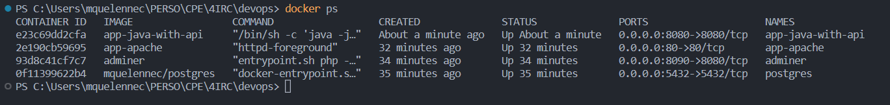

# DevOps: TP1

## Partie Postgres

> Pourquoi avons-nous besoin d'un volume à attacher à notre conteneur postgres ?

Les volumes de Docker permettent de faire persister les données d'un conteneur même après son suppression ou sa mise à jour. En attachant un volume à un conteneur PostgreSQL, on peut stocker les données de la base de données de manière permanente sur le système de fichiers hôte, plutôt que de les stocker uniquement dans le conteneur, qui pourrait être supprimé ou modifié. Ainsi, les données sont sauvegardées.

**Commandes** 

```cmd
* docker pull postgres:14.1-alpine
* docker run --name devops-postgres -e POSTGRES_PASSWORD=pwd -e  POSTGRES_USER=usr -e POSTGRES_DB=db -d postgres:14.1-alpine
* docker network create app-network
* docker run --name postgres -d --net=app-network postgres
* docker run -p 8090:8080 --name adminer --net=app-network adminer
* docker ps
* docker -v /my/own/datadir:/var/lib/postgresql/data
```
**Dockerfile**  
```Dockerfile
FROM postgres:14.1-alpine

ENV POSTGRES_DB=db \
   POSTGRES_USER=usr \
   POSTGRES_PASSWORD=pwd
```

Voir les screens dans le dossier `./postgres/screen`

## Partie HTTP

**Commandes**

```cmd
docker build -t app-appache . 
docker run -p 80:80 --name app-apache --net=app-network app-apache
```

**Dockerfile**  
```Dockerfile
FROM httpd:2.4 AS web-server
COPY ./public-html/ /usr/local/apache2/htdocs/
COPY httpd.conf /usr/local/apache2/conf/httpd.conf
```

> Pourquoi avons-nous besoin d'un proxy inverse ?

Un proxy inverse va nous permettre de faire transiter les requêtes d'un réseau privé vers l'Internet. Cela permet de masquer l'identité des utilisateurs du réseau privé, de protéger les systèmes internes contre les attaques directes depuis l'Internet et de contrôler l'accès à Internet pour les utilisateurs du réseau.

**Partie Java**

> Pourquoi avons-nous besoin d'une construction en plusieurs étapes ? Et expliquez chaque étape de ce dockerfile

```
La première déclaration FROM spécifie l'image de base pour l'environnement de construction. 
C'est une image Maven avec la version 3.8.6 et Amazon Corretto 17. L'environnement de construction est nommé "myapp-build".
La déclaration ENV définit la variable d'environnement MYAPP_HOME à "/opt/myapp".
La déclaration WORKDIR définit le répertoire de travail à MYAPP_HOME.
La déclaration COPY copie le fichier "pom.xml" et le répertoire "src" dans le répertoire de travail.
La déclaration RUN exécute la commande "mvn package" avec l'option "-DskipTests" pour construire l'application Java.
```

**Commandes**

```cmd
docker build -t app-java-with-api . 
docker run -p 8080:8080 --name app-java-with-api --net=app-network app-java-with-api
```
  
**docker compose**
