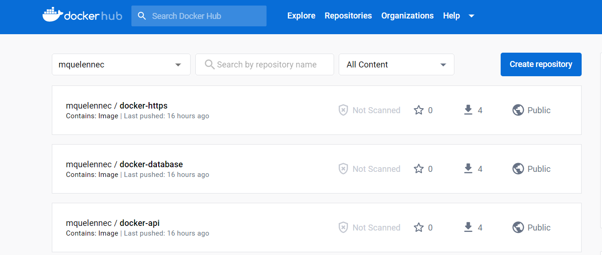
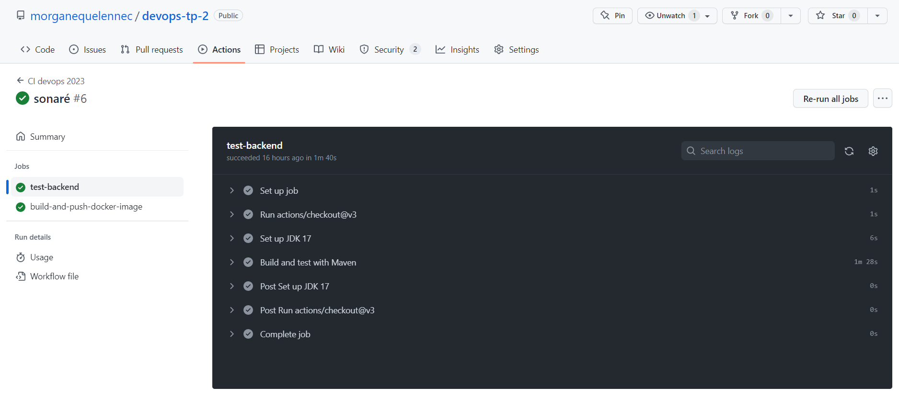
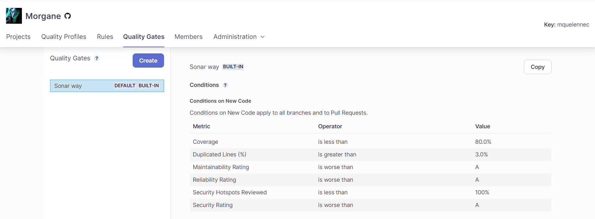

# DEVOPS - TP1 :

## Les bases de Docker

Build de l'image

```docker
docker build -t postgres .
```

Création d'un network pour nos ressources

```docker
docker network create app-network
```

Run + exécution d'un conteneur

```docker
docker run --rm \
    --name postgres \
    --env-file .env \
     -p 5432:5432 \
    --network=app-network \ 
    postgres
```

## Partie Postgres

> Pourquoi avons-nous besoin d'un volume à attacher à notre conteneur postgres ?

```docker -v /my/own/datadir:/var/lib/postgresql/data```

Les volumes de Docker permettent de faire persister les données d'un conteneur même après son suppression ou sa mise à jour. En attachant un volume à un conteneur PostgreSQL, on peut stocker les données de la base de données de manière permanente sur le système de fichiers hôte, plutôt que de les stocker uniquement dans le conteneur, qui pourrait être supprimé ou modifié. Ainsi, les données sont sauvegardées.

### Commandes

**Build de l'image**

```docker
docker build -t backend .
```

**Run du conteneur**
```
docker run --network=app-network -p 8080:8080 --name backend backend
```

**Attacher un volume au conteneur**

```docker
docker -v /my/own/datadir:/var/lib/postgresql/data
```

**Dockerfile**  
```Dockerfile
FROM postgres:14.1-alpine

ENV POSTGRES_DB=db \
   POSTGRES_USER=usr \
   POSTGRES_PASSWORD=pwd
```

Voir les screens dans le dossier `./postgres/screen`

## Partie HTTP

### Commandes

**Build de l'image**

```docker
docker build -t app-apache .
```

**Run du conteneur**
```
docker run -p 80:80 --name app-apache --net=app-network app-apache
```

**Dockerfile**  
```Dockerfile
FROM httpd:2.4 AS web-server
COPY ./public-html/ /usr/local/apache2/htdocs/
COPY httpd.conf /usr/local/apache2/conf/httpd.conf
```

> Pourquoi avons-nous besoin d'un Reverse-Proxy ?

Un proxy inverse va nous permettre de faire transiter les requêtes d'un réseau privé vers Internet. Cela permet de masquer l'identité des utilisateurs du réseau privé, de protéger les systèmes internes contre les attaques directes depuis Internet et de contrôler l'accès à Internet pour les utilisateurs du réseau.
Pour le Reverse-proxy, nous exécutons les mêmes commandes que les étapes précédents: Build et run de l'image du proxy httpd
On récupère ensuite la conf: ```docker exec -it your_running_container cat /usr/local/apache2/conf/httpd.conf > httpd.conf```

**Partie Java**

> Pourquoi avons-nous besoin d'une construction en plusieurs étapes ? Et expliquez chaque étape de ce dockerfile

L'utilisation de la construction en plusieurs étapes dans un fichier Dockerfile est un moyen efficace d'optimiser la taille de l'image finale et d'améliorer les performances du processus de construction.

Dans notre cas, la première étape consiste à construire le package Java en utilisant Maven. Le résultat de cette étape est un fichier jar. Ce fichier jar sera copié dans une image de base plus légère, comme Amazon Corretto, pour exécuter l'application. Cela signifie que la première étape de la construction peut inclure toutes les dépendances nécessaires pour la construction, telles que Maven, tandis que la seconde étape n'a besoin que des fichiers nécessaires à l'exécution de l'application.

En utilisant ce processus de construction en plusieurs étapes, vous pouvez obtenir une image plus petite, qui se télécharge et s'exécute plus rapidement, sans compromettre les ressources nécessaires à la construction.

```docker
# Construction de l'image
FROM maven:3.8.6-amazoncorretto-17 AS myapp-build
# Définition de la variable d'environnement MYAPP_HOME
ENV MYAPP_HOME /opt/myapp
# Définition du répertoire de travail
WORKDIR $MYAPP_HOME
# Copie du fichier pom.xml
COPY pom.xml .
# Copie du répertoire src
COPY src ./src
# Exécution de la commande Maven pour construire le package, en sautant les tests
RUN mvn package -DskipTests

# Exécution
FROM amazoncorretto:17
# Définition de la variable d'environnement MYAPP_HOME
ENV MYAPP_HOME /opt/myapp
# Définition du répertoire de travail
WORKDIR $MYAPP_HOME
# Copie du fichier jar construit dans la première étape dans le répertoire MYAPP_HOME
COPY --from=myapp-build $MYAPP_HOME/target/*.jar $MYAPP_HOME/myapp.jar

# Point d'entrée pour exécuter le jar
ENTRYPOINT java -jar myapp.jar
```

**Build de l'image**

```docker
docker build -t app-java-with-api . 
```

**Run du conteneur**
```
docker run -p 8080:8080 --name app-java-with-api --net=app-network app-java-with-api
```
  
**docker compose**

```docker
# Définition de la version de Docker Compose utilisée
version: '3.3'

# Définition des services Docker Compose
services:
  # Service backend
  backend:
    # Nom du container pour ce service
    container_name: backend
    # Construit une image à partir du répertoire API2
    build: ./API2
    # Utilise le réseau app-network
    networks:
      - app-network
    # Dépend du service database
    depends_on:
      - database

  # Service database
  database:
    # Nom du container pour ce service
    container_name: database
    # Redémarre automatiquement en cas de panne
    restart: always
    # Construit une image à partir du répertoire postgres
    build: ./postgres
    # Utilise le réseau app-network
    networks:
      - app-network
    # Charge les variables d'environnement à partir du fichier .env dans le répertoire database
    env_file:
      - database/.env

  # Service httpd (reverse proxy)
  httpd:
    # Nom du container pour ce service
    container_name: reverse_proxy
    # Construit une image à partir du répertoire http
    build: ./http
    # Expose le port 80 du host à travers le port 80 du container
    ports:
      - "80:80"
    # Utilise le réseau app-network
    networks:
      - app-network

# Définition des volumes Docker Compose
volumes:
  # Volume my_db_volume
  my_db_volume:
    # Pilote de stockage local
    driver: local

# Définition des réseaux Docker Compose
networks:
  # Réseau app-network
  app-network:
    # Pilote bridge pour permettre la communication entre les services et containers
    driver: bridge
```

**Commandes pour docker-compose**
```docker
docker-compose up # Lance tous les services définis par le fichier docker-compose.yml
docker-compose down # Arrête et supprime tous les coneteneurs
docker-compose ps # Affiche l'état des services
docker-compose logs # Affiche les logs des services
docker-compose build # Construit les images des services définis dans le fichier docker-compose.yml
docker-compose run # Exécute une commande dans un nouveau conteneur
docker-compose config
```

Lancement de tous les services définis par le fichier `docker-compose.yml`:  

```docker
docker-compose up
```
Vérification que les conteneurs sont bien lancés  `docker ps`:  


> Documentez vos commandes de publication et vos images publiées dans dockerhub

## Push des images sur DockerHub

**Tague des images:**
```docker
docker tag my-database mquelennec/my-database:1.0
```

**Push des images:**
```docker
docker push mquelennec/my-database
```


# DEVOPS - TP2

**Lien: https://github.com/morganequelennec/devops-tp-2**

## Créer et génération les applications

>  Que sont les conteneurs de test ?

```
Les conteneurs de test sont des bibliothèques utilisées pour le développement de logiciels. Ils permettent de créer des instances de bases de données, de serveurs et d'autres composants nécessaires à l'exécution de tests de manière isolée et reproductible. Les bibliothèques mentionnées ici sont testcontainers, jdbc et postgresql et sont gérés par le groupe org.testcontainers.
```

> Documentez vos configurations d'actions Github

**Configuration permettant de test test-backend**

```yaml
# Configuration pour un pipeline CI/CD dans DevOps 2023
name: CI devops 2023

# L'événement qui déclenche l'exécution du job est un push ou une pull request sur la banche principale
  push:
    branches:
     - main # lance le job uniquement lorsqu'un code est  push sur la branche principale
  pull_request:

# Définit le job nommé test-backend
jobs:
  test-backend: 
   # Le job s'exécute sur une machine Ubuntu 22.04
   runs-on: ubuntu-22.04

   # Étapes du job
   steps:
    # Vérifie le code sur le dépôt Github
    - uses: actions/checkout@v2.5.0

    # Configure JDK 17 avec la distribution AdoptOpenJDK
    - name: Configurer JDK 17
      uses: actions/setup-java@v3
      with:
        java-version: 17
        distribution: "adopt"

    # Construise et test l'application avec Maven
    - name: Construire et tester avec Maven
      run: mvn clean verify --file simple-api/pom.xml
```
**Résultat obtenu:**


**Configuration permettant de test test-backend + build and push docker image**
```yaml
# Définition du nom du workflow
name: CI devops 2023

# Définition des événements déclencheurs
on:
  # Déclencheur pour les événements "push" sur les branches "main"
  push:
    branches:
     - main
  # Déclencheur pour les événements "pull_request"
  pull_request:

# Définition des emplois du workflow
jobs:
  # Emploi pour tester le backend
  test-backend: 
   # Exécution sur une machine virtuelle Ubuntu 22.04
   runs-on: ubuntu-22.04
   # Étapes à exécuter dans l'emploi
   steps:
    # Vérification du code à partir de GitHub avec l'action "actions/checkout@v3"
    - uses: actions/checkout@v3

    # Configuration de JDK 17 avec l'action "actions/setup-java@v3"
    - name: Set up JDK 17
      uses: actions/setup-java@v3
      with:
        java-version: 17
        distribution: "adopt"

    # Exécution des tests avec Maven
    - name: Build and test with Maven
      run: mvn -B verify sonar:sonar -Dsonar.projectKey=morganequelennec_devops-tp-2 -Dsonar.organization=mquelennec -Dsonar.host.url=https://sonarcloud.io -Dsonar.login=${{ secrets.SONAR_TOKEN }}  --file ./simple-api/pom.xml

  # Emploi pour construire et publier les images Docker
  build-and-push-docker-image:
    # Nécessite que l'emploi "test-backend" se soit terminé avec succès
    needs: test-backend
    # Exécution sur une machine virtuelle Ubuntu 22.04
    runs-on: ubuntu-22.04
    # Étapes à exécuter dans l'emploi
    steps:
      # Vérification du code à partir de GitHub avec l'action "actions/checkout@v3"
      - name: Checkout code
        uses: actions/checkout@v3

      # Connexion à DockerHub
      - name: Login to DockerHub
        run: docker login -u ${{ secrets.DOCKERHUB_USERNAME }} -p ${{ secrets.DOCKERHUB_TOKEN }}

      # Construit et publie l'image pour le service backend
      - name: Build image and push backend
        uses: docker/build-push-action@v3
        with:
          # Chemin relatif vers le code source avec Dockerfile
          context: ./simple-api
          # Nom de tag de l'image Docker en minuscules
          tags:  ${{secrets.DOCKERHUB_USERNAME}}/docker-api
          # Push sur la branche "main"

      - name: Build image and push database
        uses: docker/build-push-action@v3
        with:
          # Chemin relatif vers le code source avec Dockerfile
          context: ./database
          tags:  ${{secrets.DOCKERHUB_USERNAME}}/docker-database
          push: ${{ github.ref == 'refs/heads/main' }}

      - name: Build image and push httpd
        uses: docker/build-push-action@v3
        with:
          # Chemin relatif vers le code source avec Dockerfile
          context: ./httpd
          tags:  ${{secrets.DOCKERHUB_USERNAME}}/docker-https
          push: ${{ github.ref == 'refs/heads/main' }}
```


**Configuration permettant de test test-backend + build and push docker image + utilise l'analyse SonarCloud lors des tests**

```yaml
# Définition du nom du workflow
name: CI devops 2023

# Définition des événements déclencheurs
on:
  # Déclencheur pour les événements "push" sur les branches "main"
  push:
    branches:
     - main
  # Déclencheur pour les événements "pull_request"
  pull_request:

# Définition des emplois du workflow
jobs:
  # Emploi pour tester le backend
  test-backend: 
   # Exécution sur une machine virtuelle Ubuntu 22.04
   runs-on: ubuntu-22.04
   # Étapes à exécuter dans l'emploi
   steps:
    # Vérification du code à partir de GitHub avec l'action "actions/checkout@v3"
    - uses: actions/checkout@v3

    # Configuration de JDK 17 avec l'action "actions/setup-java@v3"
    - name: Set up JDK 17
      uses: actions/setup-java@v3
      with:
        java-version: 17
        distribution: "adopt"

    # Exécution des tests avec Maven
    - name: Build and test with Maven
      run: mvn -B verify sonar:sonar -Dsonar.projectKey=morganequelennec_devops-tp-2 -Dsonar.organization=mquelennec -Dsonar.host.url=https://sonarcloud.io -Dsonar.login=${{ secrets.SONAR_TOKEN }}  --file ./simple-api/pom.xml

  # Emploi pour construire et publier les images Docker
  build-and-push-docker-image:
    # Nécessite que l'emploi "test-backend" se soit terminé avec succès
    needs: test-backend
    # Exécution sur une machine virtuelle Ubuntu 22.04
    runs-on: ubuntu-22.04
    # Étapes à exécuter dans l'emploi
    steps:
      # Vérification du code à partir de GitHub avec l'action "actions/checkout@v3"
      - name: Checkout code
        uses: actions/checkout@v3

      # Connexion à DockerHub
      - name: Login to DockerHub
        run: docker login -u ${{ secrets.DOCKERHUB_USERNAME }} -p ${{ secrets.DOCKERHUB_TOKEN }}

      # Construction et publication de l'image pour le service backend
      - name: Build image and push backend
        uses: docker/build-push-action@v3
        with:
          # Chemin relatif vers le code source avec Dockerfile
          context: ./simple-api
          # Nom de tag de l'image Docker en minuscules
          tags:  ${{secrets.DOCKERHUB_USERNAME}}/docker-api
          # Publication uniquement pour la branche "main"

      - name: Build image and push database
        uses: docker/build-push-action@v3
        with:
          # Chemin relatif vers le code source avec Dockerfile
          context: ./database
          tags:  ${{secrets.DOCKERHUB_USERNAME}}/docker-database
          push: ${{ github.ref == 'refs/heads/main' }}

      - name: Build image and push httpd
        uses: docker/build-push-action@v3
        with:
          # Chemin relatif vers le code source avec Dockerfile
          context: ./httpd
          tags:  ${{secrets.DOCKERHUB_USERNAME}}/docker-https
          push: ${{ github.ref == 'refs/heads/main' }}
```


> Documentez votre quality gate configuration

Ce quality gate est un ensemble de critères qui doivent être remplis pour garantir la qualité du code. 
Les critères incluent: 

* La couverture de test doit être supérieure à 80%
* La duplication de lignes ne doit pas dépasser 3%
* La maintenabilité et la fiabilité doivent être notées A
* Tous les points de sécurité doivent être examinés 
* La notation de sécurité doit être A

**Résultats obtenus**


**Normes**


# DEVOPS TP3

**Lien: https://github.com/morganequelennec/devops-tp-3**

**Questions**

> Documentez votre inventaire et vos commandes de base

**Commandes de base d'Ansible**

* `ansible all -i inventories/setup.yml -m setup -a "filter=ansible_distribution*"`: Exécute une tâche Ansible pour collecter des informations sur les hôtes définis dans le fichier de configuration inventories/setup.yml
* `ansible all` signifie qu'Ansible devra exécuter la tâche sur tous les hôtes définis dans le fichier de configuration.
* `-i inventories/setup.yml` indique à Ansible le chemin vers le fichier de configuration qui définit les hôtes cibles.
* `-m` setup indique à Ansible d'utiliser le module setup pour collecter les informations système.
* `-a "filter=ansible_distribution*"` est un argument supplémentaire pour le module setup qui permet de filtrer les informations collectées pour n'afficher que les informations relatives à la distribution d'OS (ansible_distribution).
* `-a "name=httpd state=absent"` est un argument supplémentaire pour le module yum qui définit le nom du paquet à désinstaller (httpd) et son état final désiré (absent).
* `--become` indique à Ansible de s'exécuter en tant qu'utilisateur root ou avec les privilèges nécessaires pour effectuer des modifications système.
* `ansible-inventory` : Affiche l'inventaire d'Ansible, qui décrit les hôtes et les groupes d'hôtes cibles pour les tâches d'Ansible.
* `ansible all -m ping` : Vérifie la connectivité avec tous les hôtes définis dans l'inventaire d'Ansible.
* `ansible-playbook` : Exécute un playbook Ansible, qui est un ensemble de tâches à exécuter sur les hôtes cibles.
* `ansible-galaxy` : Gère les dépendances d'Ansible sous forme de rôles.
* `ansible-vault` : Chiffre et déchiffre des fichiers sensibles, tels que les mots de passe, pour les utiliser dans des playbooks Ansible.
* `ansible-config` : Gère les paramètres de configuration d'Ansible.


**Documentation de l'inventaire**

```yaml
# Fichier de configuration Ansible

# Définition des variables pour la connexion SSH
vars:
  ansible_user: centos
  ansible_ssh_private_key_file: ../../id_rsa

# Définition d'un enfant de type "prod"
children:
  prod:
    # Définition de l'hôte cible pour les tâches d'Ansible
    hosts: morgane.quelennec.takima.cloud
```

> Documentez votre playbook et la configuration de vos tâches docker_container

```yaml
# Ce code est un playbook Ansible qui configure les hôtes pour exécuter une application web.

- hosts: all
  # Cette ligne définit la cible des tâches à venir. "all" signifie que tous les hôtes du inventaire seront utilisés.
  
  gather_facts: false
  # Désactive la collecte de données à partir des hôtes. Cela peut accélérer le processus d'exécution du playbook.
  
  become: yes
  # Exécuter les tâches suivantes avec les privilèges nécessaires pour effectuer des modifications sur les systèmes.

# Install Docker
  tasks:
  # Les tâches à exécuter sur les hôtes.
  
  - name: Clean packages
    # Nom de la tâche pour identifier facilement ce qu'elle fait.
    
    command:
      cmd: dnf clean -y packages
    # Exécute la commande `dnf clean -y packages` sur les hôtes cibles.
    
  - name: Install device-mapper-persistent-data
    # Nom de la tâche pour identifier facilement ce qu'elle fait.
    
    dnf:
      name: device-mapper-persistent-data
      state: latest
    # Installe le paquet "device-mapper-persistent-data" sur les hôtes cibles. Le paramètre "state" définit que la dernière version disponible sera installée.
    
  - name: Install lvm2
    # Nom de la tâche pour identifier facilement ce qu'elle fait.
    
    dnf:
      name: lvm2
      state: latest
    # Installe le paquet "lvm2" sur les hôtes cibles. Le paramètre "state" définit que la dernière version disponible sera installée.
    
  - name: add repo docker
    # Nom de la tâche pour identifier facilement ce qu'elle fait.
    
    command:
      cmd: sudo dnf config-manager --add-repo=https://download.docker.com/linux/centos/docker-ce.repo
    # Ajout de le dépôt Docker à la liste des sources disponibles pour les hôtes cibles.
    
  - name: Install Docker
    # Nom de la tâche pour identifier facilement ce qu'elle fait.
    
    dnf:
      name: docker-ce
      state: present
    # Installe le paquet Docker sur les hôtes cibles. Le paramètre "state" définit que le paquet doit être installé.
    
  - name: install python3
    # Nom de la tâche pour identifier facilement ce qu'elle fait.
    
    dnf:
      name: python3
    # Installe Python 3 sur les hôtes cibles.
    
  - name: Pip install
    # Nom de la tâche pour identifier facilement ce qu'elle fait.
      name: docker

# Ensure Docker service is running
  - name: Make sure Docker is running
    service: name=docker state=started
    tags: docker

# Create Docker network for the containers
  - name: Create Docker network
    docker_network:
        name: app-network
        driver: bridge
        state: present

# Start the BDD container using the specified Docker image
  - name: Start BDD
    docker_container:
        name: bdd_pg
        image: mquelennec/web_db:1.0
        env:
          POSTGRES_DB: db
          POSTGRES_USER: usr
          POSTGRES_PASSWORD: pwd
        ports:
        - 5432:5432
        networks:
        - name: app-network
        state: started
        volumes:
        - /my/own/datadir:/var/lib/postgresql/data

# Start the backend container using the specified Docker image
  - name: Start backend
    docker_container:
        name: my-java-api
        image: mquelennec/web_backend:1.0
        ports:
        - 8080:8080
        networks:
        - name: app-network
        state: started

# Start the http_front container using the specified Docker image
  - name: http_front run
    docker_container:
        name: http_front
        image: mquelennec/docker-https
        ports:
        - 80:80
        networks:
        - name: app-network
        state: started
        links:
        - my-java-api:my-java-api

# Start the devops-front container using the specified Docker image
  - name: devops-front run
    docker_container:
        name: devops-front
        image: mquelennec/docker-https
        ports:
        - 82:82
        networks:
        - name: app-network
        state: started
        links:
        - http_front:http_front
```


